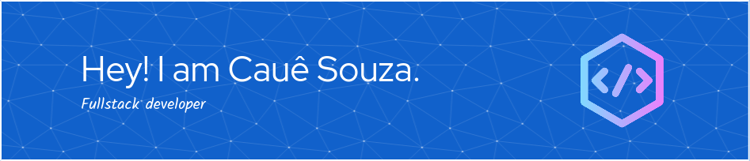

# Hello There! 👏

## 

I'm Cauê Souza (he/him) - I'm a Fullstack Developer
and an open source enthusiast from Brazil. 🇧🇷

> I'm passionate about delving into Linux and Neovim,
> exploring the coding world as a human. 👨‍💻

💡 I’m currently working on improving my **programming skills.**

📚 Currently learning - **Dart/Flutter**/**GTK** and **Web Technologies**

💬 Ask me about **Web Development** or **TypeScript**

🤝 I'm actively **seeking collaboration opportunities** on projects.
Let's create **something impactful together**!

🐈 Fun Fact: I enjoy **coding with my cats**.

---

    <code>
        <small>commit history</small>
    </code>

<picture>
 <source media="(prefers-color-scheme: dark)" srcset="https://raw.githubusercontent.com/eucaue/eucaue/output/github-contribution-grid-snake-dark.svg">
 <source media="(prefers-color-scheme: light)" srcset="https://raw.githubusercontent.com/eucaue/eucaue/output/github-contribution-grid-snake.svg">
 
</picture>

---
